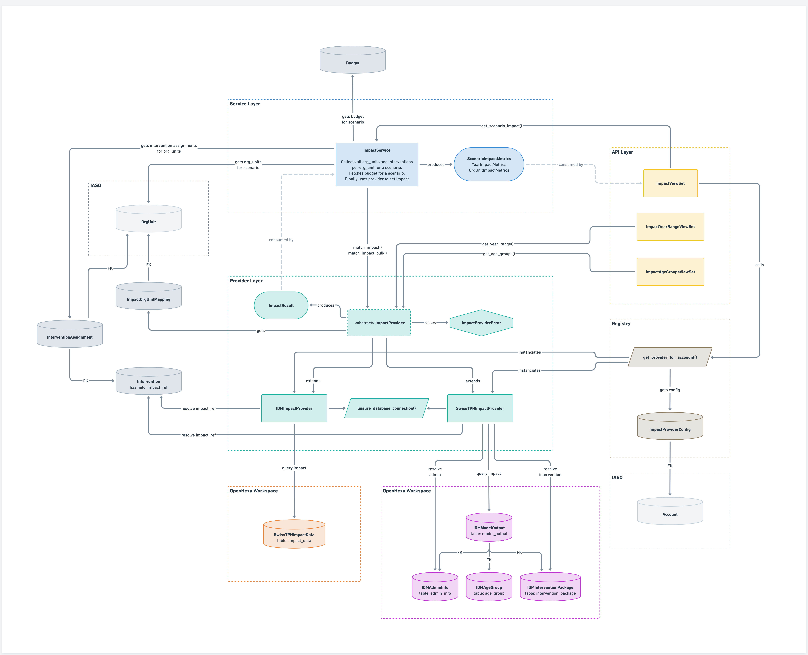

# Impact Provider Setup

The impact module connects IASO scenarios to external epidemiological impact
data sources to compute cases, prevalence, averted cases, and cost-effectiveness
metrics. The provider architecture is extensible — new providers can be added
for any data source, whether it's a database, REST API, or other integration.

## Overview

Three things must be configured per account:

1. **ImpactProviderConfig** — which provider to use, connection details, and
   provider-specific settings
2. **Intervention.impact_ref** — how IASO interventions map to the provider's
   intervention schema
3. **ImpactOrgUnitMapping** (optional) — custom mapping from IASO org units to
   the external source's geographic identifiers (falls back to `org_unit.name`)

## 1. ImpactProviderConfig (Django Admin)

Navigate to **Django Admin → SNT Malaria → Impact provider configurations** and
create a row for the account.

### Fields

| Field          | Description |
|----------------|-------------|
| `account`      | The IASO account (one config per account) |
| `provider_key` | The provider identifier (e.g. `swisstph`, `idm`) |
| `config`       | JSON with provider-specific settings (see below) |
| `secret`       | A sensitive credential — password, API key, token, etc. (encrypted at rest) |

### Config JSON

The `config` JSON structure is provider-specific. Each provider defines what
keys it expects. The `secret` field is always a single string credential,
encrypted at rest using Fernet (`ENCRYPTED_TEXT_FIELD_KEY` must be set in the
environment).

> **Note:** If the config is incomplete, the registry will gracefully return
> "no provider configured" instead of erroring, and log a warning.

**SwissTPH** (default settings — matches `admin_1`, EIR_CI values
`EIR_mean`/`EIR_lci`/`EIR_uci`):

```json
{
  "db_name": "swisstph_impact_db",
  "db_host": "your-db-host.example.com",
  "db_port": 5432,
  "db_username": "readonly_user"
}
```

Secret: the database password.

**SwissTPH for Cameroon** (matches `admin_2`, different EIR_CI labels):

```json
{
  "db_name": "swisstph_cmr_impact_db",
  "db_host": "your-db-host.example.com",
  "db_port": 5432,
  "db_username": "readonly_user",
  "admin_field": "admin_2",
  "eir_ci_mean": "middle",
  "eir_ci_lower": "low",
  "eir_ci_upper": "high"
}
```

Secret: the database password.

**IDM**:

```json
{
  "db_name": "idm_impact_db",
  "db_host": "your-db-host.example.com",
  "db_port": 5432,
  "db_username": "readonly_user"
}
```

Secret: the database password.

### Current deployments

For Switzerland, Cameroon, and Nigeria, the impact databases are hosted in
OpenHexa. Read-only credentials can be obtained from the database section in the
respective OpenHexa workspace for each account.

## 2. Intervention impact_ref

Each `Intervention` has an `impact_ref` field that tells the provider how to
match it in the external data source. The format is provider-specific. Configure
this in **Django Admin → SNT Malaria → Interventions** (the field is
list-editable).

### SwissTPH format

Use the `deployed_int_*` column name from the `impact_data` table. Multiple
columns can be comma-separated when one intervention maps to multiple columns
(e.g. `deployed_int_pbo,deployed_int_itn`).

| Intervention                                      | impact_ref              |
|---------------------------------------------------|-------------------------|
| CM                                                | `deployed_int_cm`       |
| CM Subsidy                                        | n/a, use `deployed_int_cm` for now |
| iCCM                                              | `deployed_int_iccm`     |
| IPTp (SP)                                         | `deployed_int_iptsc`    |
| IRS                                               | `deployed_int_irs`      |
| Standard Pyrethroid (Campaign / Routine / School) | `deployed_int_itn`      |
| PBO (Campaign / Routine / School)                 | `deployed_int_pbo`      |
| Dual AI (Campaign / Routine / School)             | `deployed_int_ig2`      |
| LSM                                               | `deployed_int_lsm`      |
| PMC (SP)                                          | `deployed_int_pmc`      |
| SMC (SP+AQ)                                       | `deployed_int_smc`      |
| R21 / RTS,S                                       | `deployed_int_vaccine`  |

### IDM format

Use `type:option` from the `intervention_package` table. The provider resolves
these against the `intervention_package` table to get the package ID used for
filtering `model_output`.

| Intervention                                       | impact_ref               |
|----------------------------------------------------|--------------------------|
| CM                                                 | `cm:cm`                  |
| CM Subsidy                                         | `cm_subsidy:cm_subsidy`  |
| iCCM                                               | n/a                      |
| IPTp (SP)                                          | `iptp:iptp`              |
| IRS                                                | `irs:irs`                |
| Standard Pyrethroid / PBO / Dual AI (Campaign)     | `itn_c:itn_c`            |
| Standard Pyrethroid / PBO / Dual AI (Routine)      | `itn_r:itn_r`            |
| LSM                                                | `lsm:lsm`               |
| PMC (SP)                                           | `smc:pmc`                |
| SMC (SP+AQ)                                        | `smc:smc`                |
| R21 / RTS,S                                        | `vacc:vacc`              |

### Other providers

New providers define their own `impact_ref` format. The provider's
`_map_intervention()` method is responsible for parsing the `impact_ref` string
and translating it into whatever the external source requires.

## 3. ImpactOrgUnitMapping (optional)

By default, providers match org units using `org_unit.name`. When the name in
IASO doesn't match the identifier in the external data source, create an
`ImpactOrgUnitMapping` to provide a custom `reference` string. Org units that
cannot be found in the external data source will raise an `OrgUnitMappingError`.

### Existing mapping files

Mapping files for current deployments:
- **Cameroon**: [cameroon_impact_mapping.json](management/commands/fixtures/cameroon_impact_mapping.json)
- **Nigeria**: [nigeria_impact_mapping.json](management/commands/fixtures/nigeria_impact_mapping.json)

### Loading mappings

Use the management command:

```bash
python manage.py load_impact_org_unit_mappings \
  --account "Account Name" \
  --mapping-file plugins/snt_malaria/management/commands/fixtures/cameroon_impact_mapping.json
```

Options:
- `--account` or `--account-id`: identifies the IASO account
- `--mapping-file`: path to a JSON file with the mapping tree
- `--overwrite`: update existing mappings (without this flag, existing mappings
  are skipped)

### Mapping file format

A hierarchical JSON array where each node has `name` (matching the IASO org unit
name), an optional `reference` (the identifier in the external source), and
optional `children`:

```json
[
  {
    "name": "Region Name",
    "reference": "region_name_in_external_source",
    "children": [
      { "name": "District A", "reference": "district_a_in_external_source" },
      { "name": "District B", "reference": "district_b_in_external_source" }
    ]
  }
]
```

If `reference` is omitted, it defaults to the node's `name`. The hierarchy is
used to disambiguate org units with the same name by matching the ancestor path.

### Manual editing via Django Admin

Navigate to **Django Admin → SNT Malaria → Impact org unit mappings**. The
`reference` field is list-editable for quick bulk updates.

## Verification

After setup, the impact API endpoints should return data:

- `GET /api/snt_malaria/impact/year_range/` — returns `{min_year, max_year}`
- `GET /api/snt_malaria/impact/age_groups/` — returns available age groups
- `GET /api/snt_malaria/impact/?scenario=<id>&age_group=<group>` — returns
  impact metrics if the intervention mix of the scenario is found in the
  impact data

If the provider is not configured or config is incomplete, these endpoints
return a 404 with "No impact data provider configured for this account."

Org units not found in the external data source will raise an
`OrgUnitMappingError` — check the `ImpactOrgUnitMapping` references and verify
they exist in the provider's data.

## Architecture


