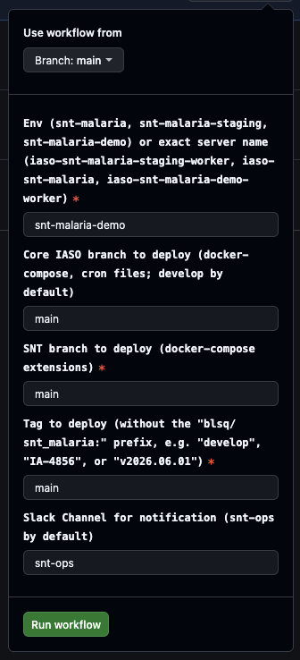
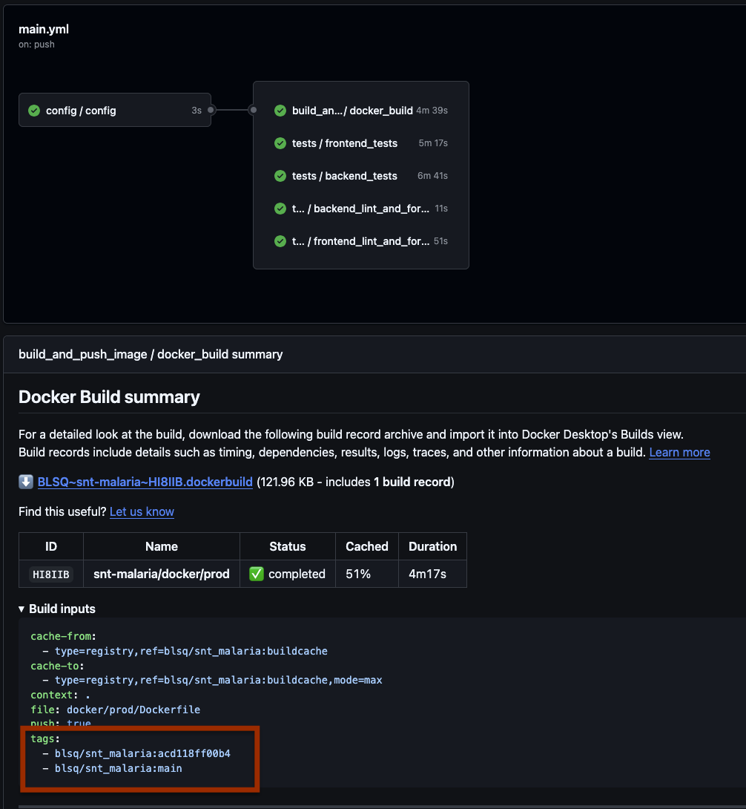

# Release

## Conventions

Always merge your PR using conventional commits, so Release Please will generate gracious release notes.

We try to keep history as clean as possible using squash merge and by keeping develop on top of main.

## Merge changes into master

Depending on what you need to release, you can merge your changes into master (develop, hotfix branch, ...).

`git checkout main`
`git merge origin/develop`
`git push`

A new pull request will be generated by Release Please.
If you look at that PR, description should look good if you used conventional commits.
It can happen that somebody forgot or did a typo, you can correct the description by hand then.

## Merge release please PR

Once you are ready and sure nothing else needs to be added, you can merge release please PR (which just add release notes and tags).

## Deploy to environment

First send a message to snt-iaso-task-force channel to let them know that the release will start

To deploy to an environment, you can go to the github action: [Deploy SNT Malaria docker](https://github.com/BLSQ/snt-malaria/actions/workflows/docker_deploy.yml)

Fill all inputs based on where and what you want to deploy

If you are not sure about which tag to use, you can go to the CI build, expand the Build inputs and check tags: 

**Note:** When deploying to prod, always deploy first to demo, do a round of safe checks here [https://demo.snt-toolbox.org](https://demo.snt-toolbox.org) then deploy to prod.

## Deploy completed

Send a message to the channel again to let them know it is released and share the release notes.

Check with other developers that it is fine for you to rebase develop onto master then do it.

`git checkout develop`
`git fetch`
`git pull`
`git rebase origin/master`

