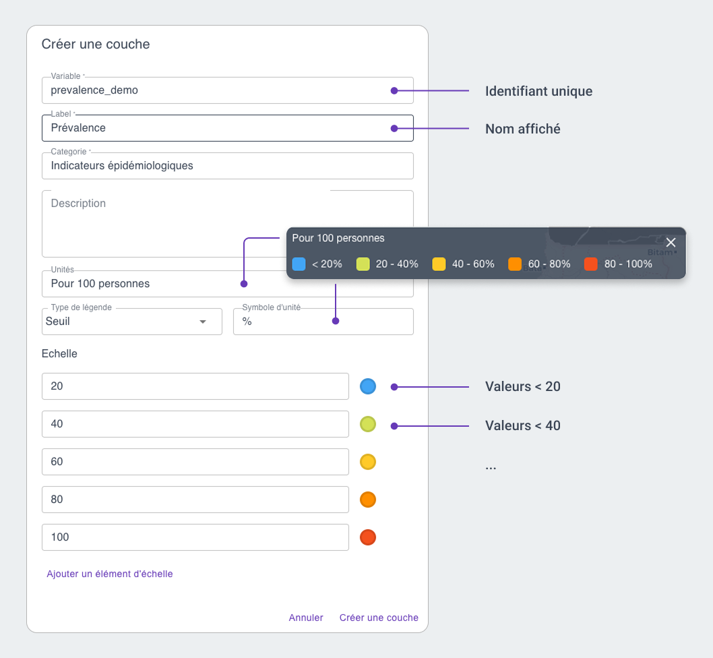
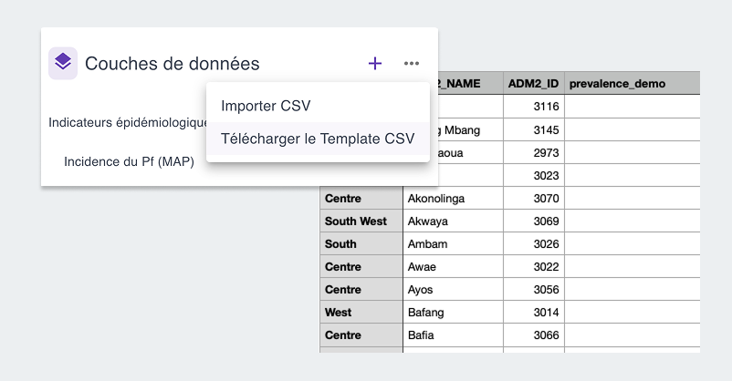
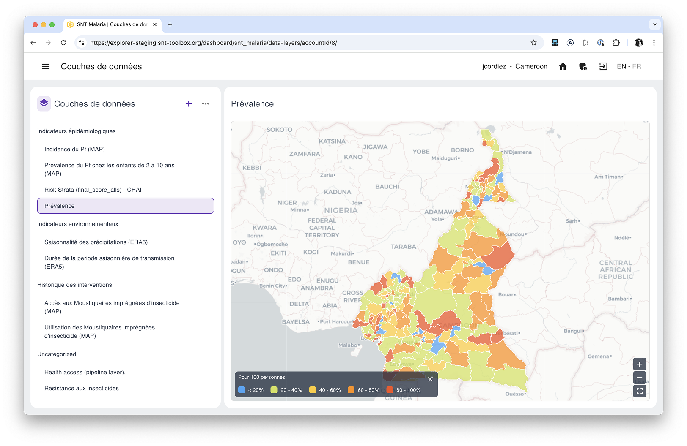

# Importer des couches de données

En complément de la [Bibliothèque de pipelines SNT](https://www.snt-toolbox.org/fr/snt-pipeline-library/), l’application SNT Explorer permet également d’importer des données au format CSV. Découvrez dans la vidéo ci-dessous comment faire.

<iframe src="https://www.loom.com/embed/030e43e9b2024316bbaa24d16a330005" frameborder="0" webkitallowfullscreen mozallowfullscreen allowfullscreen style="position: absolute; top: 0; left: 0; width: 100%; height: 100%;"></iframe>

## Etapes
### 1. Créer une couche

La première étape est une étape de définition: il s’agit de nommer et décrire la couche que vous souhaitez importer, et surtout définir l’échelle qui sera utilisée pour son affichage.

Pour créer une nouvelle couche, cliquez sur le + en haut à droite de la liste, et remplissez les détails utiles.

Vous avez à tout le moment la possibilité de modifier chacun de ces détails, à l’exception du nom de variable.

Les différents types d’échelles disponibles sont
| Type | Usage |
| --- | --- |
| Seuil | Permet de stratifier les valeurs “par niveau” (eg de 0 à 20%, de 20 à 40%, etc) |
| Ordinal | Permet de stratifier des valeurs non numériques, ou fixes (eg low, medium, high, ou 1,2,3) |
| Linéaire | Affiche les valeurs sur un dégradé continu entre un minimum et un maximum |

### 2. Télécharger le modèle CSV

Une fois vos nouvelles couches définies, cliquez sur les … en haut à droite de la liste, et sélectionnez “**Télécharger le modèle CSV.**”

Ceci téléchargera un fichier CSV dans lequel il ne vous restera plus qu’à remplir les valeurs liées à la couche que vous venez de définir.

### 3. Importer les données
Une fois ce fichier CSV rempli, re-cliquez sur les … et sélectionnez “**Importer CSV**” pour finaliser la création de nouvelle couche.

